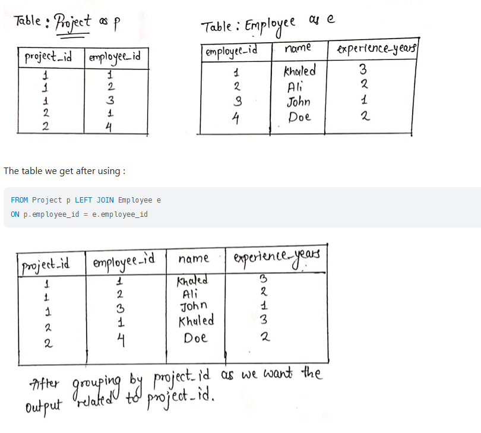

## General Issue

- Date format is YYYY-MM-DD, e.g. '1940-05-30'

- `LIKE` is not case sensitive

- It is not possible to test for `NULL` values with comparison operators, such as `=` and `!=`

- `ORDER BY` always goes after `WHERE` (if `WHERE` is present)

- `LIMIT` always goes at the very end of the query

- Standard SQL format:

  ```SQL
  SELECT column_name(s)
  FROM table_name
  WHERE condition
  GROUP BY column_name(s)
  HAVING condition
  ORDER BY column_name(s);
  ```

  

## SQLite

**Advantage**:

1. Does not involve a server application 
2. Best for testing, development, and in any other scenario where it makes sense for the database to be on the same disk as the application code.

**Disadvantage**:

1. When many different users are updating the table at the same time (to maintain integrity of data, only one user can write to the file at a time)
2. Less secure for private data
3. Limited advanced features
4. SQLite does not validate data types even the schema constrains the type of data

## **CREATE TABLE**

```sql
CREATE TABLE table_name (
	column_1 data_type, # id INTEGER
	column_2 data_type, # name TEXT
  column_3 data_type # age INTEGER
);
```

- `Clause` performs specific tasks in SQL, e.g. CREATE TABLE
- `Parameter` is a list of columns, data types, or values that are passed to a clause as an argument, e.g. (column_1 data_type, column_2 data_type, column_3 data_type)

## INSERT (add rows)

```sql
INSERT INTO celebs (id, name, age)
VALUES (1, "Justin Bieber", 29);
```

- `VALUES` is a clause that indicates the data being inserted.

## ALTER (add columns)

```sql
ALTER TABLE celebs
ADD COLUMN twitter_handle TEXT;
```

- The `ALTER TABLE` statement adds a new column to a table. You can use this command when you want to add columns to a table.
- `NULL` is a special value in SQL that represents missing or unknown data. Here, the rows that existed before the column was added have `NULL` (∅) values for `twitter_handle`.

## UPDATE (change rows)

```sql
UPDATE celebs 
SET twitter_handle = '@taylorswift13' 
WHERE id = 4; 
```

- The `UPDATE` statement edits a row in a table. You can use the `UPDATE` statement when you want to change existing records.

## CONSTRAINTS

```sql
CREATE TABLE celebs (
   id INTEGER PRIMARY KEY, 
   name TEXT UNIQUE,
   date_of_birth TEXT NOT NULL,
   date_of_death TEXT DEFAULT 'Not Applicable'
);
```

- `PRIMARY KEY` columns can be used to uniquely identify the row. Attempts to insert a row with an identical value to a row already in the table will result in a *constraint violation* which will not allow you to insert the new row.
- `UNIQUE` columns have a different value for every row. This is similar to `PRIMARY KEY` except a table can have many different `UNIQUE` columns.

## AS

```sql
SELECT name AS 'Titles'
FROM movies;
```

- Renames a column or table with an alias for display, does not permanently change table/column names in the database.

## DISTINCT (No Unique query in SQL)

```sql
SELECT DISTINCT genre 
FROM movies;
```

## LIKE

- `LIKE` is not case sensitive

```SQL
SELECT * 
FROM movies
WHERE name LIKE 'Se_en';
```

- `LIKE` is a special operator used with the `WHERE` clause to search for a specific pattern in a column.
- `name LIKE 'Se_en'` is a condition evaluating the `name` column for a specific pattern.
- `Se_en` represents a pattern with a *wildcard* character.
- The `_` means you can substitute any individual character here without breaking the pattern

```sql
SELECT * 
FROM movies
WHERE name LIKE 'A%';
```

- `%` is a wildcard character that matches zero or more missing characters in the pattern, i.e. `A%` matches all movies with names that begin with letter ‘A’

```sql
SELECT * 
FROM movies 
WHERE name LIKE '%man%';
```

- any movie that *contains* the word ‘man’ in its name will be returned in the result.

## IS NULL and IS NOT NULL

```sql
SELECT name
FROM movies 
WHERE imdb_rating IS NOT NULL;
```

## BETWEEN

```sql
SELECT *
FROM movies
WHERE name BETWEEN 'A' AND 'J';
```

- The `BETWEEN` operator is used in a `WHERE` clause to filter the result set within a certain range
- It accepts two values that are either **numbers**, **text** or **dates**
  - In this case, the ones that begin with 'J' are not included. Only if a movie has a name of simply ‘J’, it would match.

## CASE

```sql
SELECT name,
	CASE
		WHEN genre = 'romance' THEN 'Chill'
		WHEN genre = 'comedy' THEN 'Chill'
		ELSE 'Intense'
	END AS 'Mood' #Rename the new column as Mood
FROM movies;
```

```sql
SELECT
    CASE 
        WHEN id%2 = 0 THEN id-1
        WHEN id%2 = 1 AND id+1 IN (SELECT id FROM Seat WHERE id IS NOT NULL) THEN id+1
        ELSE id
    END AS id, student
FROM Seat
ORDER BY id
```

- *Refer to LeetCode - SQL 50 - 626. Exchange Seats*

## ORDER BY

```sql
SELECT DISTINCT authod_id as id
FROM Views
WHERE author_id = viewer_id ORDER BY id DESC
```

## LENGTH()

```sql
SELECT tweet_id
FROM Tweets
WHERE LENGTH(content) > 15
```

## LEFT JOIN

```SQL
SELECT column_name(s)
FROM table1
LEFT JOIN table2
ON table1.column_name = table2.column_name;
```

- `LEFT JOIN` returns all records from the left table (table1), and the matching records from the right table (table2). All records from the left table are returned, even if there are no matches in the right table.

- *Refer to LeetCode - SQL 50 - 1581. Customer Who Visited but Did Not Make Any Transactions*

Example:


## JOIN = INNER JOIN (contrast to left/right join)

```SQL
SELECT p.ProductID, p.ProductName, c.CategoryName
FROM Products AS p
INNER JOIN Categories AS c ON Products.CategoryID = Categories.CategoryID;
```

- `INNER JOIN` returns only rows with a match in both tables. No record would be returned if there is no match
- *Refer to LeetCode - SQL 50 - 1661. Average Time of Process per Machine*
  - Hint: When we have all the information in one table, we create a duplicated table with `JOIN`. With two identical table, we manipulate the data using conditional argument.

## CROSS JOIN

```SQL
SELECT column_name(s)
FROM table1
CROSS JOIN table2;
```

- `CROSS JOIN` returns all records from both tables no matter there is matching or no matching records
- If `WHERE` clause is added, e.g. WHERE a.id = b.id, it will produce the same result as the `INNER JOIN` clause
- `CROSS JOIN` is VERY HELPFUL in case you want to look up `a_id` that belongs to `b_id` in the same table
- *Refer to LeetCode - SQL 50 - 1731. TheNumberOfEmployeesWhichReportToEachEmployee*

## IF()

```SQL
IF(condition, value_if_true, value_if_false);

SELECT IF(500<1000, 5, 10);

SELECT OrderID, Quantity, IF(Quantity>10, "MORE", "LESS")
FROM OrderDetails;
```

- *Refer to LeetCode - SQL 50 - 1934. Confirmation Rate*

## SUM()

```SQL
SELECT p.product_id, IFNULL(ROUND(SUM(p.price*u.units)/SUM(u.units), 2), 0) AS average_price
FROM Prices AS p
LEFT JOIN UnitsSold AS u
ON p.product_id = u.product_id
AND u.purchase_date BETWEEN p.start_date AND p.end_date
GROUP BY p.product_id
```

- `p.price` is the price of the product during that specific period, and `u.units`  is the number of units sold during that specific period. Multiplying these gives the total revenue for that specific sale
- Each specific sale is specified due to the `BETWEEN` condition
- `SUM(p.price * u.units)` adds up the total revenue across all matching/specific sales
- *Refer to LeetCode - SQL 50 - 1251. Average Selling Price*

## Subquery

```SQL
SELECT contest_id, ROUND(COUNT(r.user_id)/(SELECT COUNT(user_id) FROM Users)*100, 2) AS percentage
FROM Register AS r
GROUP BY r.contest_id
ORDER BY percentage DESC, contest_id ASC
```

- A `subquery` is essentially a query nested within another query, allowing users to perform operations that depend on the results of `another query`
- This makes it invaluable for tasks such as `filtering`, `calculating aggregates`, or even modifying data dynamically
- *Refer to LeetCode - SQL 50 - 1633.Percentage Of Users Attended A Contest*

## IN

```SQL
SELECT * FROM Customers
WHERE Country IN ('Germany', 'France', 'UK');
```

- The `IN` operator allows you to specify multiple values in a `WHERE` clause
- The `IN` operator is a shorthand for multiple `OR` conditions

## IN (SELECT)

```SQL
SELECT ROUND(AVG(order_date = customer_pref_delivery_date)*100, 2) AS immediate_percentage
FROM Delivery
WHERE (customer_id, order_date) IN (
    SELECT customer_id, MIN(order_date)
    FROM Delivery
    GROUP BY customer_id
)
```

- With a subquery you can return all records from the main query that are present in the result of the subquery

- `order_date = customer_pref_delivery_date` creates a Boolean expression
  - If the dates match, it returns `TRUE` (which is equivalent to `1`)
  - If the dates don't match, it returns `FALSE` (which is equivalent to `0`)
- *Refer to LeetCode - SQL 50 - 1174. Immediate Food Delivery II*

```SQL
SELECT employee_id, department_id
FROM Employee
WHERE primary_flag = "Y" OR employee_id IN (
    SELECT employee_id FROM Employee GROUP BY employee_id HAVING COUNT(department_id) = 1
)
```

- *Refer to LeetCode - SQL 50 - 1789. Primary Department for Each Employee*

## COUNT()

```SQL
SELECT DATE_FORMAT(trans_date, '%Y-%m') AS month,
country,
COUNT(id) AS trans_count,
SUM(IF(state="approved", 1, 0)) AS approved_count,
SUM(amount) AS trans_total_amount,
SUM(IF(state="approved", amount, 0)) AS approved_total_amount
FROM Transactions
GROUP BY country, month
```

- The question is why we are using `SUM()` instead of `COUNT()` for `SUM(IF(state="approved", 1, 0)) AS approved_count`?
  - `COUNT()` counts on non-Null values. Since the result will return either 1 or 0, `COUNT()` counts on both 1 or 0. As a result, it will not be correct
- *Refer to LeetCode - SQL 50 - 1193.Monthly Transactions I*

## UNION()

```SQL
SELECT DISTINCT product_id, 10 as price 
FROM Products 
GROUP BY product_id
HAVING MIN(change_date) > "2019-08-16"
UNION 
SELECT product_id, new_price AS price
FROM Products
WHERE (product_id, change_date) IN (
    SELECT product_id, MAX(change_date)
    FROM Products 
    WHERE change_date <= '2019-08-16'
    GROUP BY product_id
);
```

- The `UNION` operator is used to combine the result-set of two or more `SELECT` statements.

- Every `SELECT` statement within `UNION` must have the same number of columns

- The columns must also have similar data types and in the same order
  - It is VERY USEFUL if we use the same table
- The `UNION` operator selects only distinct values by default. To allow duplicate values, use `UNION ALL`
  - `UNION ALL` is less computationally expensive as it does not need to filter out the duplicate rows
